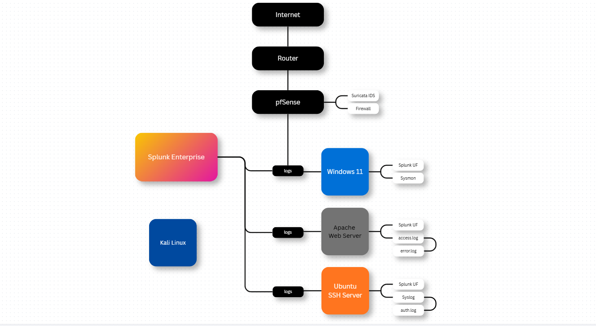

# Splunk SOC Home Lab


---

## Overview

This project demonstrates the design and implementation of a small Security Operations Center (SOC) home lab using Splunk Enterprise.

The lab simulates real-world attack scenarios against a Windows endpoint while collecting Windows Event Logs and Sysmon telemetry for investigation, detection, and incident response.

The goal is to gain practical experience with SIEM, endpoint telemetry, threat detection, log analysis, and SOC workflows.

---

## Lab Architecture



# Technologies Used

- Splunk Enterprise
- Splunk Universal Forwarder
- Sysmon
- Windows Event Logs
- Kali Linux
- Windows 11
- PowerShell
- Nmap
- SSH
- VirtualBox

---

# Project Structure

```
Splunk-Home-Lab/

├── attacks/
├── configs/
├── diagrams/
├── docs/
├── reports/
├── screenshots/
├── spl/
└── README.md
```

---

# Attack Scenarios

## 1. PowerShell Reverse Shell

Status: ✅ Completed

### Objective

Simulate a malicious PowerShell payload executed on the Windows endpoint.

### Detection

- Sysmon Process Creation
- PowerShell Operational Logs
- Windows Security Logs

### Investigation

- Search malicious PowerShell execution
- Review command line
- Identify parent process
- Correlate timestamps

### Incident Response

- Isolated endpoint
- Terminated malicious PowerShell process
- Removed payload
- Verified clean system

MITRE ATT&CK

- T1059.001 — PowerShell

---

## 2. SSH Brute Force

Status: 🚧 In Progress

### Detection

- Windows Security Event ID 4625
- Sysmon Network Connections

MITRE ATT&CK

- T1110 — Brute Force

---

# Screenshots

Project screenshots are available inside:

```
screenshots/
```

Including:

- Splunk installation
- Universal Forwarder installation
- Sysmon installation
- Attack execution
- Splunk detections
- Incident response

---

# Configuration Files

```
configs/
```

Contains

- inputs.conf
- outputs.conf
- Sysmon configuration

---

# SPL Queries

```
spl/
```

Contains detection queries used during the investigation.

---

# Skills Demonstrated

- SIEM Administration
- Splunk Search Processing Language (SPL)
- Windows Event Log Analysis
- Sysmon Analysis
- Threat Detection
- Incident Investigation
- Incident Response
- Network Monitoring
- Endpoint Monitoring

---

# Future Improvements

- Additional attack simulations
- Custom dashboards
- Scheduled alerts
- Detection rules
- Threat hunting use cases

---

# Author

**Mohammad Ali**

Cybersecurity | SOC Analyst

LinkedIn

https://www.linkedin.com/in/mohdali02/

GitHub

https://github.com/Mohd-Ali2

---
